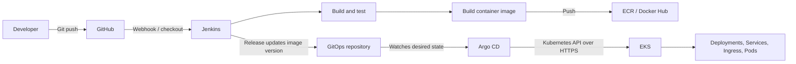
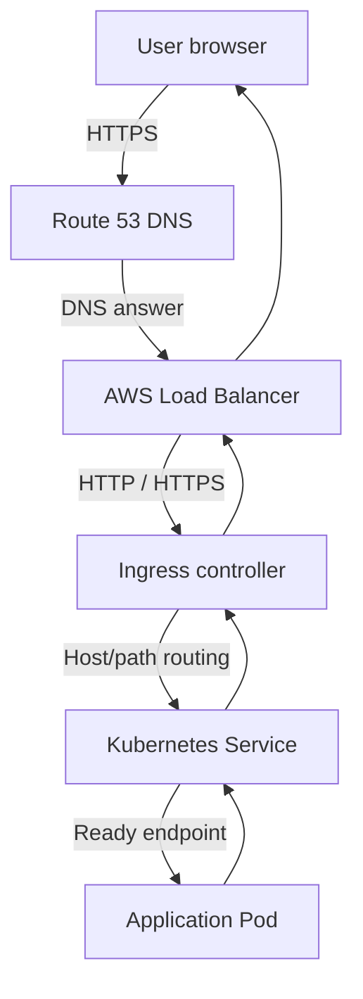
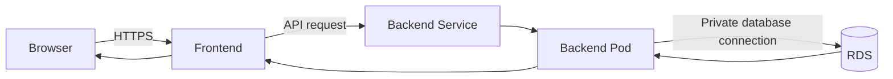

# DevOps Production Workflow on AWS EKS


## 1. Two separate flows

### CI/CD deployment flow



### Runtime user-traffic flow



**Remember:** Argo CD manages deployment through the Kubernetes API. It
is not normally in the user's live request path.

## 2. CI/CD: code to running application

### Step 1 --- Developer → GitHub

A developer commits and pushes source code, pipeline files, and
configuration:

``` bash
git add .
git commit -m "Add login feature"
git push origin main
```

GitHub stores code and its history. Teams may keep application source
and Kubernetes configuration in separate repositories.

### Step 2 --- GitHub → Jenkins

Jenkins can be triggered by: - **Webhook:** GitHub sends Jenkins an
HTTPS event after a push. - **Poll SCM:** Jenkins checks the repository
periodically for new commits.

A webhook is commonly used for faster event-driven triggering.

### Step 3 --- Jenkins pipeline

Jenkins reads the `Jenkinsfile` and automates stages such as checkout,
build, tests, security checks, image build, and image push. Jenkins is
the automation engine, not the production application server.

### Step 4 --- Build and publish image

Example:

``` bash
docker build -t <registry>/<team>/<app>:1.0.0 .
docker push <registry>/<team>/<app>:1.0.0
```

The registry can be Amazon ECR or Docker Hub. - **Image:** packaged
application artifact. - **Container:** running instance created from an
image. - Prefer unique, traceable release tags or digests; do not rely
on `latest` for controlled production releases. - Keep registry
credentials in an approved secret/credential store, not in Git.

### Step 5 --- GitOps repository

A GitOps repo stores the desired Kubernetes configuration:

``` text
attendx-gitops/
├── namespace.yaml
├── deployment.yaml
├── service.yaml
├── ingress.yaml
└── values.yaml
```

Example image declaration:

``` yaml
spec:
  template:
    spec:
      containers:
        - name: attendx
          image: <registry>/<team>/attendx:1.0.0
```

The release process updates the image version in Git. Depending on the
team's design, Jenkins may make that update or a separate reviewed
release process may do it.

### Step 6 --- Argo CD → EKS

Argo CD watches Git and compares: - **Desired state:** what Git
declares. - **Live state:** what exists in Kubernetes.

If they differ, Argo CD reports `OutOfSync`. When sync is enabled or
approved, it applies the declared resources through the Kubernetes API
over HTTPS. It does not normally SSH into nodes or directly create
containers.

### Step 7 --- Kubernetes runs Pods

EKS provides a managed Kubernetes control plane. Worker capacity runs
Pods. A Deployment maintains the requested replica count:

``` text
Deployment (replicas: 3)
        |
     ReplicaSet
    /    |    \
  Pod   Pod   Pod
```

Kubernetes can replace failed Pods, but `Running` alone does not mean
the application is ready to receive traffic. Readiness checks and
application tests matter.

## 3. Runtime: browser request to Pod

Suppose the user opens `https://attendx.example.com/login`.

1.  **DNS:** The browser resolves the domain. Route 53 can return/alias
    to the load-balancer endpoint. DNS helps find the destination; it
    does not carry the application's HTTP response.
2.  **Load balancer:** The browser connects to the public endpoint,
    commonly HTTPS/TCP 443. The load balancer can terminate TLS and
    forward traffic.
3.  **Ingress:** An Ingress rule can route by host/path, for example `/`
    to `frontend-service` and `/api` to `backend-service`.
4.  **Ingress controller:** Implements the Ingress rules. Creating an
    Ingress object alone does not guarantee an AWS load balancer; a
    suitable controller, permissions, and configuration are required. In
    EKS, AWS Load Balancer Controller can manage an ALB for supported
    Ingress configurations.
5.  **Service:** A Kubernetes Service gives a stable in-cluster endpoint
    and selects matching ready Pod endpoints.
6.  **Pod:** The selected application Pod processes the request and
    returns the response through the networking path.

Example:

``` text
Browser
  -> Route 53
  -> AWS Load Balancer
  -> Ingress controller
  -> frontend-service
  -> ready frontend Pod
  -> response to browser
```

## 4. Frontend → backend → database



The browser should call an API, not connect directly to a private
database. Backend Pods connect to the database over a restricted private
network path. Store database credentials securely, never in source code
or a public image.

## 5. Where Terraform fits

Terraform commonly provisions cloud infrastructure:

``` text
Terraform
  ├── VPC, subnets, route tables
  ├── IAM roles and policies
  ├── EKS and node groups
  ├── Security groups
  ├── RDS and supporting resources
  └── Other AWS resources
```

Common responsibility split: - **Terraform:** cloud infrastructure. -
**Jenkins:** build, test, scan, and publish application artifacts. -
**Argo CD:** reconcile Kubernetes application configuration from Git. -
**EKS/Kubernetes:** schedule and operate workloads.

Teams may choose different boundaries. Avoid having multiple tools
unintentionally manage the same resource.

## 6. Communication and ports

  -----------------------------------------------------------------------
  Connection              Typical protocol/port   Purpose
  ----------------------- ----------------------- -----------------------
  Developer ↔ GitHub      HTTPS or SSH            Push/pull code

  GitHub → Jenkins        HTTPS                   Notify Jenkins
  webhook                                         

  Jenkins → registry      HTTPS                   Push image

  Argo CD → Git provider  HTTPS or SSH            Read GitOps config

  Argo CD → Kubernetes    HTTPS, commonly TCP 443 Apply/observe resources
  API                                             

  Browser → public ALB    HTTPS, TCP 443          Secure app access

  Load balancer → target  Configured HTTP/HTTPS   Forward request
                          target port             

  Service → Pod           Application TCP port    Reach Pod endpoint

  Backend → MySQL RDS     TCP 3306, if MySQL      Database connection
  -----------------------------------------------------------------------

Exact ports/protocols depend on the application, controller, target
type, and configuration. Allow only required traffic.

## 7. Production checklist --- do not skip

### Security

-   [ ] Least-privilege IAM roles; prefer workload roles/temporary
    credentials over long-lived keys where possible.
-   [ ] Kubernetes RBAC with least privilege.
-   [ ] Secrets stored in an approved secret manager/workflow, never
    committed to Git.
-   [ ] HTTPS/TLS and certificate renewal.
-   [ ] Private database; restrict security groups and network paths.
-   [ ] Scan dependencies and container images; use trusted base images.
-   [ ] Apply network policies where supported and appropriate.

### Reliability and availability

-   [ ] Multiple replicas for critical services.
-   [ ] Spread workloads across nodes and Availability Zones where
    required.
-   [ ] Configure readiness, liveness, and startup probes correctly.
-   [ ] Set CPU/memory requests and limits based on testing.
-   [ ] Configure Pod disruption budgets and rollout settings where
    appropriate.
-   [ ] Configure autoscaling with tested metrics and sufficient
    capacity.
-   [ ] Test node, Pod, and dependency failures.

### Delivery and rollback

-   [ ] Build once; promote the same tested artifact between
    environments.
-   [ ] Use immutable/traceable image tags or digests.
-   [ ] Run tests and security checks before production.
-   [ ] Use rolling, canary, or blue/green rollout according to risk.
-   [ ] Have a tested rollback procedure.
-   [ ] Review and audit production Git changes.

### Observability and operations

-   [ ] Centralized application/platform logs.
-   [ ] Monitor latency, traffic, errors, resource saturation, restarts,
    and node health.
-   [ ] Actionable alerts and an incident process.
-   [ ] Correlate releases with errors and metrics.
-   [ ] Back up databases and important configuration.
-   [ ] Test restore and disaster-recovery procedures.
-   [ ] Document runbooks and ownership.

### Release verification

-   [ ] Pods are **Ready**, not merely Running.
-   [ ] Service endpoints exist.
-   [ ] Load-balancer targets are healthy.
-   [ ] DNS and TLS work from outside the cluster.
-   [ ] Application smoke tests pass.
-   [ ] Backend-to-database connectivity works.
-   [ ] Logs/metrics show no unexpected errors.
-   [ ] Rollback path is known.

## 8. Common misunderstandings

  -----------------------------------------------------------------------
  Component               Does                    Does not do by itself
  ----------------------- ----------------------- -----------------------
  GitHub                  Stores source/config    Run the app after a
                          and history             push

  Jenkins                 Automates pipeline      Act as the Kubernetes
                          steps                   cluster

  Docker image            Packages the app        Equal a running
                                                  container

  ECR/Docker Hub          Stores images           Deploy the image by
                                                  itself

  Terraform               Provisions              Replace app health
                          infrastructure          checks

  Argo CD                 Syncs Git-defined       Carry normal user
                          Kubernetes state        requests

  EKS                     Provides managed        Automatically expose an
                          Kubernetes control      app publicly
                          plane                   

  Ingress                 Defines HTTP(S) routing Create an AWS LB
                          rules                   without a suitable
                                                  controller

  Service                 Stable in-cluster       Automatically provide a
                          endpoint for Pods       public domain

  Route 53                DNS and routing         Host the application
                          policies                
  -----------------------------------------------------------------------

## 9. Final mental model

**Deployment path:**

``` text
Code -> GitHub -> Jenkins -> Image registry
                         |
GitOps repo -> Argo CD -> Kubernetes API -> EKS workloads
```

**User request path:**

``` text
Browser -> Route 53 -> Load Balancer -> Ingress -> Service -> Ready Pod
```

Keep these paths separate: Jenkins and Argo CD deliver/reconcile the
application; DNS, load balancing, Ingress, and Services route user
traffic to it.
